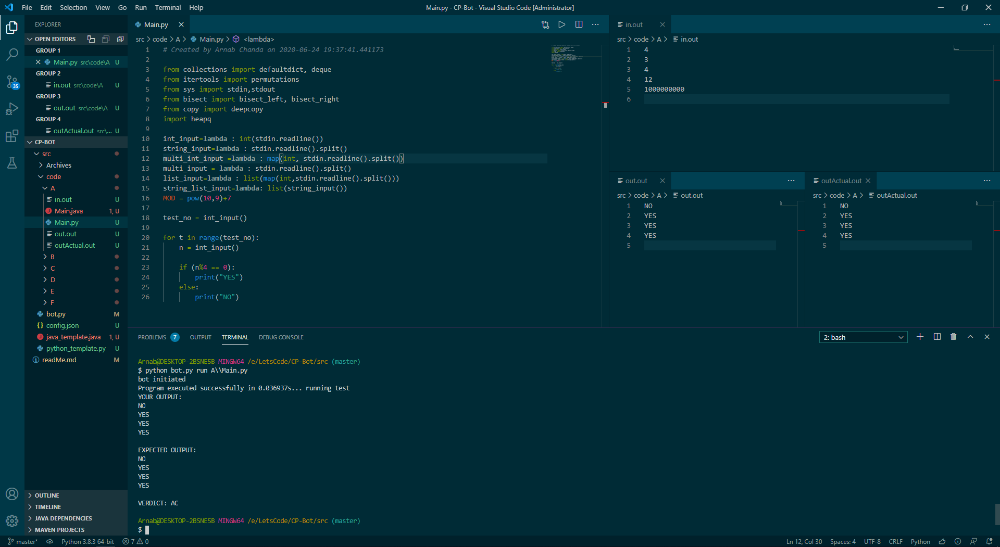
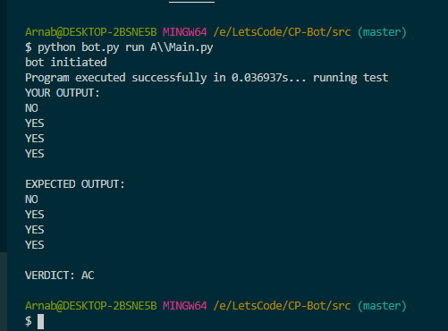
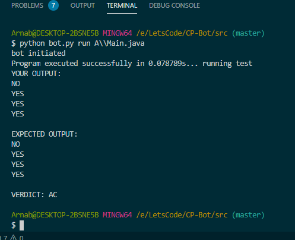
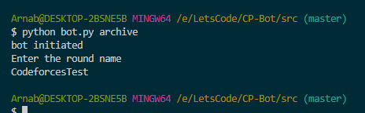

# Compeetitive coding bot

This is a simple all in one competitive coding bot that can help ease the pain during a cp contest when you are encountering 
"WA on test 212" and questioning your existence.

## Dont we have enough bots aldready?

Yes I agree that we have lots of bots but whatever we have is not enough!
WE NEED MORE BOTS

So, I was having a lot of trouble moving back and forth between java and python during contests and switching tabs and resizing windows trying to veryfy the answers. So
I had to make this, to somehow make the process easier. To somehow get one step closer to Gennedy. What?! tools and languages dont matter in cp you say? Oh shit!

### Okay so what does this bot do?

This bot can do the following - 

* Quickly create the directory structure of a contest with files containing your template code. It also generates testing files.
* The bot runs your code and evaluates the result against the test files present, giving you a verdict.

 

* The bot archives all contest files and code that you had written to be stored away. 

### Okay so how do I use this? 

All you need to do is to download the bot.py and run the command "python bot.py new". 
Add your template files - only java and python is supported as of now. 

To run a program give the command -  *"python bot.py [problem directory]\\Main.extension"* - example usage - python bot.py A\\Main.java
To parse a new contest say *python bot.py new*
To archive a contest say *python bot.py archive*

### Directory structure - 

The project has the following directory structure - 

Top level directory has the following directories - 

* Archives (this stores all the archives)
* Code (this stores all the problem folders and files)
* python_template.py (this file contains the editabele python file in which you can add your template)
* java_template.java (this file contains the editable java file in which you can add your template)
* config.json (this file contains all settings required for the bot to run)
* bot.py (This has the source code of the bot)

### Platform -  Windows
